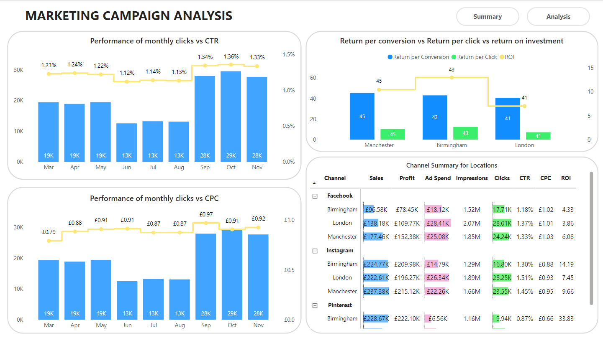

<!DOCTYPE html>
<html lang="en">
<head>
    <meta charset="UTF-8">
</head>
<body>
    <h1> 📈 Marketing Campaign Analysis Dashboard</h1>
    

      This <strong>Marketing Campaign Analysis Dashboard</strong> is a visually engaging and comprehensive report created in <strong>Power BI</strong>, based on a dataset from <strong>Kaggle</strong>. 
      The dashboard demonstrates my expertise in <strong>data analysis</strong> and <strong>data visualization</strong> by evaluating the effectiveness of marketing campaigns across multiple channels.
    

    

      This project is part of my <strong>professional portfolio</strong> to showcase my ability to extract actionable insights, craft meaningful stories from data, and design intuitive dashboards that enable data-driven decision-making.
    

  <h2>🛠️ Skills Acquired from This Project</h2>
    <ul>
        <li><strong>Power BI Proficiency:</strong> Expertise in creating interactive and visually compelling dashboards.</li>
        <li><strong>DAX Expertise:</strong> Created custom calculations and measures to deliver complex analytics.</li>
        <li><strong>Interactive Filtering:</strong> Enabled user-driven analysis with slicers for campaigns, channels, and locations.</li>
        <li><strong>Marketing Analytics:</strong> Applying data-driven techniques to evaluate campaign performance and optimize marketing strategies.</li>
        <li><strong>Data Visualization:</strong> Designed intuitive and dynamic dashboards with Power BI.</li>
        <li><strong>Data Cleaning and Transformation:</strong> Ensuring data quality and consistency using Power Query Editor.</li>
    </ul>

<h2>⚙️ Data Cleaning</h2>
    <ul>
        <li><strong>Removed Duplicates:</strong> Ensured data integrity by eliminating duplicate rows.</li>
        <li><strong>Column Transformation:</strong> Standardized data formats (e.g., dates, currencies) for analysis.</li>
        <li><strong>Calculated Fields:</strong> Created custom metrics such as ROI, ROAS, and CPC to align with business goals.</li>
        <li><b>Renamed and Cleaned Fields:</b> Renamed columns for clarity and ensured consistent naming conventions throughout the dataset.</li>
    </ul>

  <h2>📊 Dashboards</h2>
    <h3>1. Summary Dashboard</h3>
    
This dashboard provides a comprehensive overview of marketing campaign performance through visually compelling and data-rich insights. It is designed to support decision-making by highlighting key metrics and trends in an intuitive format.

    

  <h4>Key Performance Indicators (KPIs)</h4>
    <ul>
        <li><strong>Total Sales:</strong> £1.73M</li>
        <li><strong>Conversion Rate:</strong> 22.17%</li>
        <li><strong>Ad Spend:</strong> £163.25K</li>
        <li><strong>Engagement Rate:</strong> 5.46%</li>
        <li><strong>Total Profit:</strong> £1.57M</li>
        <li><strong>ROAS (Return on Ad Spend):</strong> 10.61</li>
    </ul>

  <h4>Visual Breakdown</h4>
    <ul>
        <li><strong>Campaign vs. Channel Insights (Pie Chart):</strong>  
            <ul>
                <li><strong>Campaign View:</strong> Highlights the sales split by Spring, Summer, and Fall campaigns, with <strong>Fall campaign contributing the largest share (43.25%)</strong>.</li>
                <li><strong>Channel View:</strong> Visualizes sales contributions across Instagram, Pinterest, and Facebook, where <strong>Instagram leads with 39.54% of total sales</strong>.</li>
            </ul>
        </li>
        <li><strong>Monthly Trends:</strong>  
            <ul>
                <li>A combined <strong>bar and line chart</strong> showcases trends in sales, profit, and ad spend, with <strong>peak revenue months in September and October</strong>.</li>
                <li>Engagement metrics reveal audience interactions, with <strong>shares peaking in October (16K)</strong>.</li>
            </ul>
        </li>
        <li><strong>Channel Performance Table:</strong> A detailed table compares sales, profits, engagement, and ROI across platforms. <strong>Pinterest boasts the highest ROAS (22.47)</strong>, while <strong>Facebook dominates impressions (5.44M)</strong>.</li>
    </ul>

  <h3>2. Analysis Dashboard</h3>
  
This advanced dashboard offers a deeper dive into campaign performance, focusing on clicks, cost-effectiveness, and return metrics across multiple locations and channels.

  

  <h4>Performance Metrics</h4>
    <ul>
        <li><strong>Monthly Clicks vs. CTR (Click-Through Rate):</strong>  
            <ul>
                <li>Bar and line charts track <strong>click performance</strong> and CTR from <strong>March to November</strong>.</li>
                <li><strong>October</strong> saw the highest click count (29K) and a <strong>CTR peak at 1.36%</strong>, indicating effective ad placements.</li>
            </ul>
        </li>
        <li><strong>Monthly Clicks vs. CPC (Cost per Click):</strong>  
            <ul>
                <li>The chart reveals fluctuations in click volume and CPC, with <strong>September recording the highest CPC (£0.97)</strong>, reflecting increased competition or higher bids during peak campaign periods.</li>
            </ul>
        </li>
    </ul>

  <h4>Location-Based ROI</h4>
    <ul>
        <li><strong>Return per Conversion vs. Return per Click vs. ROI (Bar and Line Chart)</strong>  
            <ul>
                <li>Performance varies across locations:</li>
                <li><strong>Manchester:</strong> Achieved the highest <strong>Return per Conversion (45)</strong> and overall ROI.</li>
                <li><strong>Birmingham and London:</strong> Followed closely in performance, with slight variations in clicks and spending efficiency.</li>
            </ul>
        </li>
        <li><strong>Channel Summary Table by Location</strong>  
            <ul>
                <li><strong>Best ROI:</strong> Pinterest in Birmingham with an ROI of 33.83.</li>
                <li><strong>Top Sales Location:</strong> Manchester on Instagram (£237.38K).</li>
                <li><strong>Highest CTR:</strong> Instagram in London (1.51%).</li>
            </ul>
        </li>
    </ul>
    <h2>🚀 Final Notes</h2>
    

        This project serves as a comprehensive demonstration of my expertise in data analysis, visualization, and reporting. By combining analytical techniques with intuitive designs, I have created a solution that transforms raw data into actionable insights, enabling stakeholders to make informed and impactful decisions. The dashboard not only captures the essence of effective data communication but also reflects my ability to align technical solutions with business objectives. I am eager to apply this expertise in a professional environment where I can address challenging problems and deliver meaningful results.
    

</body>
</html>
