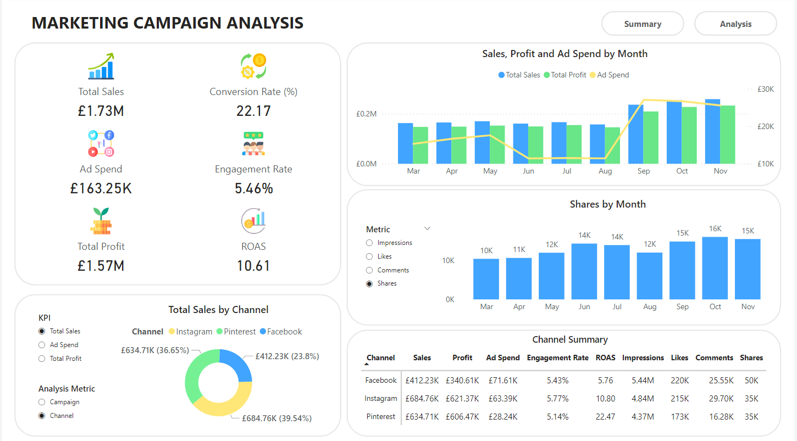

<!DOCTYPE html>
<html lang="en">
<head>
    <meta charset="UTF-8">
</head>
<body>
    <h1>Marketing Campaign Analysis Dashboard</h1>
    

      This <strong>Marketing Campaign Analysis Dashboard</strong> is a visually engaging and comprehensive report created in <strong>Power BI</strong>, based on a dataset from <strong>Kaggle</strong>. 
      The dashboard demonstrates my expertise in <strong>business intelligence</strong>, <strong>data analysis</strong>, and <strong>data visualization</strong> by evaluating the effectiveness of marketing campaigns across multiple channels.
    

    

      This project is part of my <strong>professional portfolio</strong> to showcase my ability to extract actionable insights, craft meaningful stories from data, and design intuitive dashboards that enable data-driven decision-making.
    

  <h2>🌟 Project Highlights</h2>
    <h3>Key Features:</h3>
    <ul>
        <li><strong>Dynamic Insights:</strong> Interactive filters enable an in-depth breakdown of performance by <strong>Campaign</strong>, <strong>Channel</strong>, and <strong>Location</strong>, offering tailored perspectives on key metrics like sales, clicks, and ROI.</li>
        <li><strong>Visual Storytelling:</strong> Clean and visually engaging design emphasizes clarity while facilitating actionable decision-making.</li>
        <li><strong>Business Impact:</strong> Focus on ROI-driven metrics such as <strong>ROAS</strong>, <strong>CPC (Cost per Click)</strong>, and <strong>CTR (Click-Through Rate)</strong>, which align with real-world marketing goals.</li>
    </ul>

  <h2>📊 Dashboard Details</h2>
    <h3>1. Summary Dashboard</h3>
    
    
The summary page highlights top-line metrics that summarize campaign performance:

  <h4>Key Performance Indicators (KPIs)</h4>
    <ul>
        <li><strong>Total Sales:</strong> £1.73M</li>
        <li><strong>Conversion Rate:</strong> 22.17%</li>
        <li><strong>Ad Spend:</strong> £163.25K</li>
        <li><strong>Engagement Rate:</strong> 5.46%</li>
        <li><strong>Total Profit:</strong> £1.57M</li>
        <li><strong>ROAS (Return on Ad Spend):</strong> 10.61</li>
    </ul>

  <h4>Visual Breakdown</h4>
    <ul>
        <li><strong>Campaign vs. Channel Insights (Pie Chart):</strong>  
            <ul>
                <li><strong>Campaign View:</strong> Highlights the sales split by Spring, Summer and Fall campaigns, with <strong>Fall campaign contributing the largest share (43.25%)</strong>.</li>
                <li><strong>Channel View:</strong> Visualizes sales contributions across Instagram, Pinterest, and Facebook, where <strong>Instagram leads with 39.54% of total sales</strong>.</li>
            </ul>
        </li>
        <li><strong>Monthly Trends:</strong>  
            <ul>
                <li>A combined <strong>bar and line chart</strong> showcases trends in sales, profit, and ad spend, with <strong>peak revenue months in September and October</strong>.</li>
                <li>Engagement metrics reveal audience interactions, with <strong>shares peaking in October (16K)</strong>.</li>
            </ul>
        </li>
        <li><strong>Channel Performance Table:</strong> A detailed table compares sales, profits, engagement, and ROI across platforms. <strong>Pinterest boasts the highest ROAS (22.47)</strong>, while <strong>Facebook dominates impressions (5.44M)</strong>.</li>
    </ul>

  <h3>2. Analysis Dashboard</h3>
  
    
The analysis page delves deeper into <strong>performance by locations</strong> and <strong>monthly trends</strong>.

  <h4>Performance Metrics</h4>
    <ul>
        <li><strong>Monthly Clicks vs. CTR (Click-Through Rate):</strong>  
            <ul>
                <li>Bar and line charts track <strong>click performance</strong> alongside CTR from <strong>March to November</strong>.</li>
                <li><strong>October</strong> saw the highest click count (29K) and a <strong>CTR peak at 1.36%</strong>, indicating effective ad placements.</li>
            </ul>
        </li>
        <li><strong>Monthly Clicks vs. CPC (Cost per Click):</strong>  
            <ul>
                <li>The chart reveals fluctuations in click volume and cost per click (CPC), with <strong>September recording the highest cost per click (£0.97)</strong>, reflecting increased competition or higher bids during peak campaign periods.</li>
            </ul>
        </li>
    </ul>

  <h4>Location-Based ROI</h4>
    <ul>
        <li><strong>Return per Conversion vs. Return per Click vs. ROI (Bar and Line Chart):</strong>  
            <ul>
                <li>Performance varies across locations:</li>
                <li><strong>Manchester:</strong> Achieved the highest <strong>Return per Conversion (45)</strong> and overall ROI.</li>
                <li><strong>Birmingham and London:</strong> Followed closely in performance, with slight variations in clicks and spend efficiency.</li>
            </ul>
        </li>
        <li><strong>Channel Summary Table by Location:</strong>  
            <ul>
                <li><strong>Best ROI:</strong> Pinterest in Birmingham with an ROI of 33.83.</li>
                <li><strong>Top Sales Location:</strong> Manchester on Instagram (£237.38K).</li>
                <li><strong>Highest CTR:</strong> Instagram in London (1.51%).</li>
            </ul>
        </li>
    </ul>
</body>
</html>
